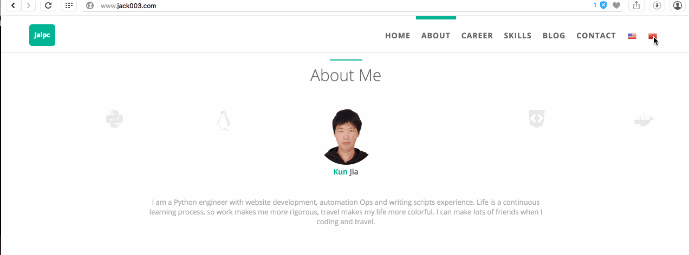
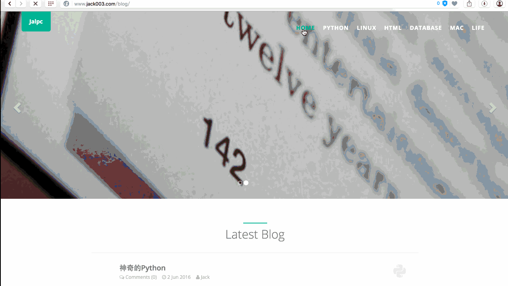

[](https://opensource.org/licenses/mit-license.php)
[](http://github.com/badges/stability-badges)
[](https://github.com/ellerbrock/open-source-badge/)



Simple blog consisiting of a dev diary among other thingss

## Getting Started

If you're completely new to Jekyll, I recommend checking out the documentation at <http://jekyllrb.com> website but it is piss easy to set up. 
 'gem install jekyll bundler
  jekyll new <whatever-the-hell-you-want-to-call-it>
  cd whatever-the-hell-you-want-to-call-it
  bundle exec jekyll serve'

### Modify `_config.yml`

The _config.yml located in the root of the jalpc_jekyll_theme directory contains all of the configuration details for the Jekyll site.

#### Index page

The index page is seprated into several sections and they are located in `_includes/sections`,the configuration is in `_config.yml` and section's detail configuration is in `_data/*.yml`.

#### Modify `_data/*.yml`

These files are used to dynamically render pages, so you almost don't have to edit *html files* to change your own theme, besides you can use `jekyll serve --watch` to reload changes.

The following is mapping between *yml file* to *sections*.

* blog.yml  ==>  _includes/header.html(id="navbar")
* careers.yml  ==>  index.html(id="careers")
* links.yml  ==>  index.html(id="links")
* projects.yml  ==>  index.html(id="project")
* skills.yml  ==>  index.html(id="skills")

### Jekyll Serve

Then, start the Jekyll Server. I always like to give the --watch option so it updates the generated HTML when I make changes.

```
$ jekyll serve --watch
```

Now you can navigate to localhost:4000 in your browser to see the site.

### Using Github Pages

You can host your Jekyll site for free with Github Pages. [Click here](https://pages.github.com) for more information.

A configuration tweak if you're using a gh-pages sub-folder

In addition to your github-username.github.io repo that maps to the root url, you can serve up sites by using a gh-pages branch for other repos so they're available at github-username.github.io/repo-name.

This will require you to modify the _config.yml like so:

``` yml
# Welcome to Jekyll!

# Site settings
title: Website Name

baseurl: "/"
url: "http://github-username.github.io"
# url: "http://127.0.0.1:4000"

# author
author:
  name: nickname
  first_name: firstname
  last_name: lastname
  email: your_email@example.com
  facebook_username: facebook_example
  github_username: 'github_example
  head_img: 'path/of/head/img'

# blog img path
img_path: '/path/of/blog/img/'
```

If you start server on localhost, you can turn on `# url: "http://127.0.0.1:4000"`.

### Page counter

Many third party page counter platform is to slow,so I count my website page view myself,the javascript file is `static/js/count_index.js`,the backend is [Leancloud](https://leancloud.cn).

### Web analytics

I use [Baidu analytics](http://tongji.baidu.com/web/welcome/login) and [Google analytics](https://www.google.com/analytics/) to do web analytics, you can choose either to realize it,just register a account and replace id in `_config.yml`.

### Comment

I use [Changyan](http://changyan.kuaizhan.com/) and [Disqus](https://disqus.com/) to realize comment.

#### Changyan
To configure Changyan, get the appid and conf in <http://changyan.kuaizhan.com/>. Then, in `_config.yml`, edit the changyan value to enable Changyan.

#### Disqus
To configure Disqus,you should set disqus_shortname and get public key and then, in `_config.yml`, edit the disqus value to enable Disqus.

### Share

I use [bshare](http://www.bshare.cn/) to share my blog on other social network platform. You can register a count and get your share uuid.

### Search engines

I use javascript to realize blog search,you can double click `Ctrl` or click the icon at lower right corner of the page,the detail you can got to this repo: <https://github.com/androiddevelop/jekyll-search>.

Just use it.



### CNAME

Replace your website domain in **CNAME** file.